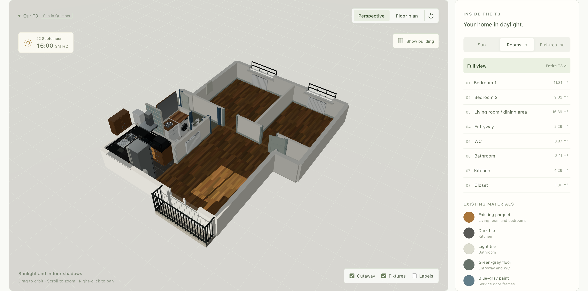
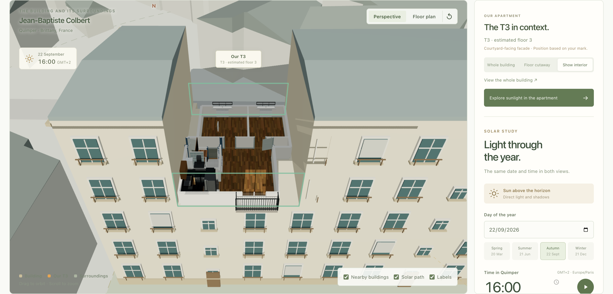
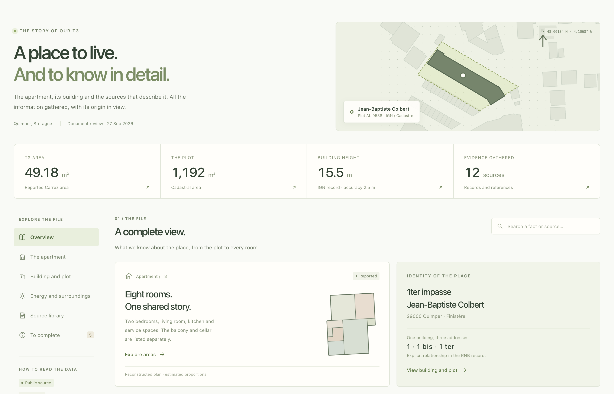

# T3 Designer

**Explore the space. Follow the light. See the bigger picture.**

A 3D workspace for understanding a home, from the parquet underfoot to the
buildings across the courtyard. Explore rooms and fixtures, watch daylight move
through the windows, and keep the property's sources and open questions close
at hand.

Built around a two-bedroom apartment in **Quimper, Brittany**, with a shared
model for interactive browser exploration and offline Blender renders.



[Quick start](#quick-start) · [Take a tour](#take-a-tour) · [How it works](#how-it-works) · [Documentation](docs/README.md)

## Take a tour

### Watch a day unfold

Scrub the timeline or press play to follow sunlight through the apartment and
across the surrounding buildings. Jump between seasons, focus on a room, and
switch between interior and exterior views without losing the selected moment.
The solar path, altitude chart and sunrise/sunset times tell the same story at
different scales.


*Solar time follows Quimper's `Europe/Paris` timezone, including daylight-saving
changes. Nighttime disables direct sunlight.*

### From rooms to neighbourhood

- **Inspect the apartment.** Switch between perspective and floor plan, focus on
  individual rooms, and toggle cutaways, fixtures and labels. Browse the fixture
  catalog for dimensions, source references and individual GLB downloads.
- **Put it in context.** Explore the surrounding building volumes, locate the
  apartment, then reveal its floor or interior. Camera cutaways preserve the
  shadows of walls, ceilings and neighbouring buildings.
- **Read the evidence.** The property dossier brings together public records,
  reported areas, visual observations, source links and unresolved questions.
  Its bundled content is available alongside the model without a database setup.

| Building and sun | Property dossier |
| --- | --- |
|  |  |
| Reveal the apartment inside its building and surroundings. | Follow the sources behind the reconstruction. |

The interface is available in **English, Spanish and French**, with **light,
dark and system themes**. Open **Settings** to choose your appearance and
language; preferences are saved in your browser.

## Quick start

Use **Node.js 24+**, **pnpm 12.7.0** (the repository pin), and a browser with
WebGL 2 enabled.

```sh
pnpm install
pnpm dev
```

Open the Vite URL shown in the terminal, normally
[localhost:5173](http://localhost:5173).

**Drag** to orbit · **Scroll** to zoom · **Right-drag** to pan

A good first lap:

1. In **Apartment → Sun**, focus the **Living room** and move the time slider.
2. Compare **Summer** and **Winter** to see how the light changes.
3. Try **Floor plan**, then toggle **Cutaway** or **Show building**.
4. Open **Building and sun** and choose **Floor cutaway** or **Show interior**.
5. Visit **Documentation** to explore the property dossier and its sources.

The browser app uses the checked-in model, GLBs and geographic extract. Blender
is optional. The solar controls calculate locally; changing the date or time
does not call an external API.

## How it works

**One metric model, two rendering workflows.** React and Three.js provide the
interactive view. A validated JSON snapshot carries the apartment, fixtures,
building context and selected sun position into Blender for offline rendering.

Rooms, walls, openings and placements remain editable TypeScript data. The app
loads individual GLBs for fixtures; the apartment is not stored as a single
opaque mesh. Layout changes currently happen in the source data.

| Where | What it owns |
| --- | --- |
| [`apps/web`](apps/web) | React UI, Three.js scenes, translations and materials |
| [`apps/web/src/data`](apps/web/src/data) | Apartment geometry, fixtures, building context, placement and dossier |
| [`apps/web/src/lib/solar.ts`](apps/web/src/lib/solar.ts) | Shared sun geometry and Quimper civil-time conversion |
| [`packages/scene-schema`](packages/scene-schema) | Domain validation and the versioned project contract |
| [`packages/geometry`](packages/geometry) | Renderer-independent polygons, bounds and wall segmentation |
| [`scripts/blender`](scripts/blender) | Asset auditing, scene assembly and rendering |

All geometry uses metres. Both rendering workflows share geometry, placement
and solar inputs; materials and renderer settings have their own implementations.
See the [architecture guide](docs/architecture/architecture.md) for data ownership,
coordinate conventions and extension boundaries.

## Development

The complete code and data check also requires **Python 3.10+**:

```sh
pnpm check
```

This runs lint, TypeScript checks, Node and Python tests, read-only snapshot
verification, and the production build. It does not require Blender or MCP.

| Command | Purpose |
| --- | --- |
| `pnpm dev` | Start the web development server |
| `pnpm build` | Build the production web app |
| `pnpm test` | Run package, script and Python tests |
| `pnpm scene:verify` | Check tracked snapshots against canonical data without writing |
| `pnpm test:e2e` | Run Playwright browser tests |
| `pnpm check:all` | Run `check`, browser tests and the production analytics suite |

For browser tests, install Playwright's Chromium once with
`pnpm --filter @t3-designer/web exec playwright install chromium`.
See [internationalization](docs/architecture/i18n.md) and
[analytics and privacy](docs/analytics.md) for the browser validation workflows.
The [screenshot capture guide](docs/workflows/readme-media.md) explains how to
regenerate this README's screenshots and animation from the running app.

### Render with Blender

With Blender installed, export the current source data and render the combined
scene in a background process:

```sh
pnpm scene:snapshot    # Refresh the four tracked JSON snapshots
pnpm blender:render    # Assemble the combined scene and render with Cycles CPU
```

The default snapshot uses **2026-09-26 at 15:00, Europe/Paris**, independently of
the browser's selected time. Generated `.blend`, validation and PNG outputs go
under the ignored `artifacts/` directory. Set `BLENDER_BIN` if Blender is not at
the standard macOS location or on `PATH`.

For custom dates, separate output files, asset audits and all render options,
see the [Blender workflow](docs/workflows/blender.md). The background pipeline
works without an open Blender window or an MCP connection.

## About the reconstruction

This is an evolving, evidence-based reconstruction of one apartment. **Its
dimensions and building placement are approximate.** The reported room areas
sum to **49.18 m²**, but the model is not a measured net-area survey.

The building context uses a local extract of **99 building footprints**,
source heights, roads and the cadastral parcel. Apartment orientation, facade
openings, roof forms and some fixture dimensions are inferred. Ground is flat;
terrain, distant obstructions, clouds and vegetation are outside the current
model. The exact bathroom layout still needs measurements, and the basement
has not been reconstructed.

Sunlight and shadows are a **visual study**, not a certified insolation, energy
or measured irradiance report. The dossier distinguishes reported facts,
observations and pending evidence; apartment-specific diagnostics and legal-lot
confirmation remain open.

For the underlying assumptions, see [apartment geometry](docs/model/apartment-geometry.md),
[building placement](docs/model/apartment-placement.md),
[solar calculations and limits](docs/model/solar-model.md), and
[source provenance](docs/reference/evidence.md).

## Documentation and privacy

The [documentation index](docs/README.md) brings together the architecture,
research, workflows and checkpoints. Start with:

- [Building research and data attribution](docs/research/building-research.md)
- [Property dossier scope and sources](docs/research/property-dossier.md)
- [Blender commands and preserved reference scenes](docs/workflows/blender.md)
- [Analytics and privacy](docs/analytics.md)

The app includes a `/privacy` notice and consent controls. Optional Umami
analytics requires both public build configuration and visitor consent; the
supplied Website ID is blank. The privacy page itself is never measured.

## License and attribution

Original code, documentation, authored 3D geometry and generated textures are
available under the [MIT License](LICENSE). Copyright © 2026 Pablo Coronel.
Forks, modifications and commercial use are welcome; retain the required
copyright and license notices.

If you build on this work, credit **T3 Designer by Pablo Coronel (pablitxn)** and
link to the original repository. This is appreciated, not an additional license
condition.

Third-party dependencies, public datasets and externally supplied reference
material retain their own licenses and rights. Preserve the source attribution
and retrieval dates documented in the [building research](docs/research/building-research.md)
and [reference evidence](docs/reference/evidence.md).
